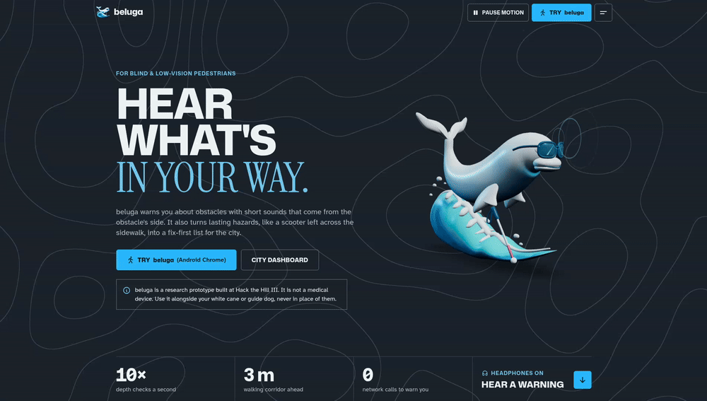
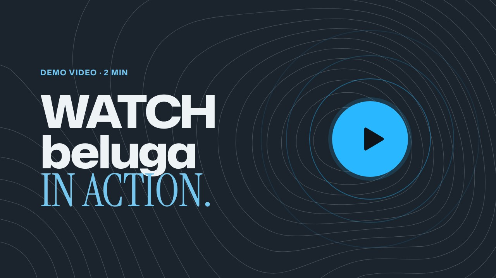
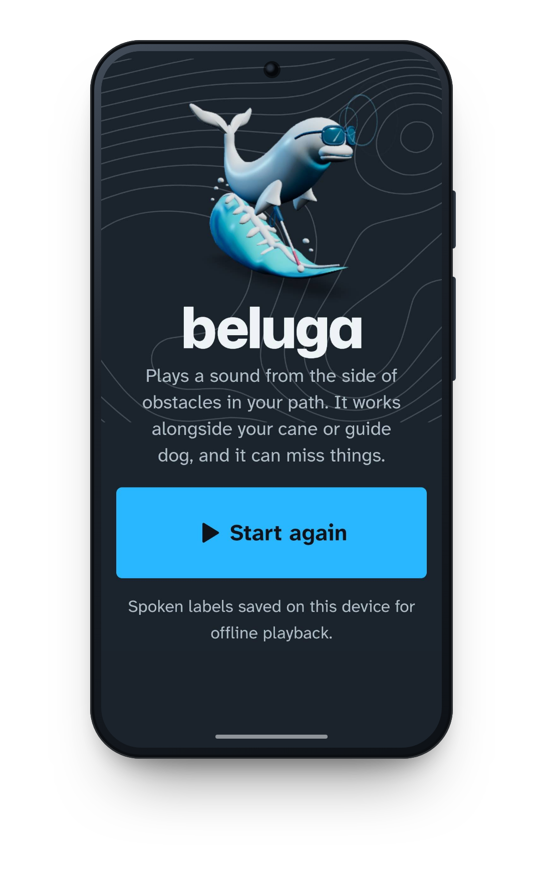
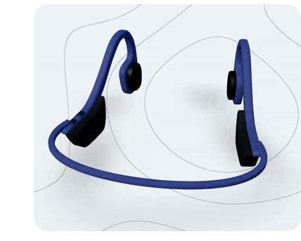
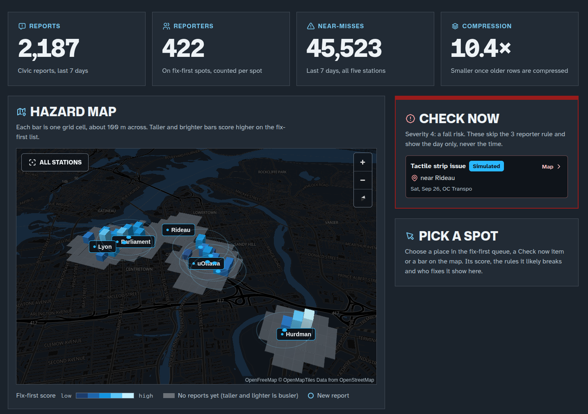
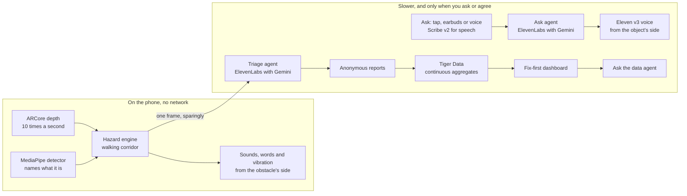

<h1 align="center">beluga 🐋</h1>

<strong>Hear what's in your way.</strong>

Short sounds from the side of each obstacle for blind and low-vision pedestrians, and a fix-first list of lasting hazards for the city.

  
  
  
  

  <a href="https://www.beluga.surf/walk"><strong>Try beluga</strong></a> ·
  <a href="https://www.beluga.surf/map"><strong>City dashboard</strong></a> ·
  <a href="https://www.youtube.com/watch?v=Pz9jS8v5VJ8"><strong>Demo video</strong></a> ·
  <a href="https://devpost.com/software/beluga-p495j3"><strong>Devpost</strong></a>

> [!NOTE]
> beluga is a research prototype built at Hack the Hill III. It is not a medical device. Use it alongside your white cane or guide dog, never in place of them.

## Demonstration video 🎬

## Motivation

Belugas find their way by echolocation. They listen to sound bouncing back from what is around them.

Walking a sidewalk takes more than knowing where to turn. A scooter left across the path, a sign at head height or an unexpected drop-off can change a familiar route in an instant. A white cane finds what is on the ground, but it can miss the sign and the edge. And the city rarely hears about any of it.

So we built beluga around two ideas. A phone on your chest does the listening and tells you what is in your way. Then the hazards that keep getting in people's way become a list the city can fix, worst first.

## Hackathon tracks 🏆

We built beluga at [Hack the Hill III](https://hack-the-hill-iii.devpost.com/) at uOttawa, Sept 26 to 27, 2026. It is entered in the General challenge, Civic Technology, Best UI/UX, and four sponsor prizes.

| Track | What beluga brings |
| --- | --- |
| <picture><source media="(prefers-color-scheme: dark)" srcset="images/logos/elevenlabs-dark.png"></picture> **[Best Use of ElevenLabs](#elevenlabs)** | Three agents that see and look things up through client tools, 12 designed warning sounds, five Eleven v3 voices recorded lossless at 48 kHz, and Scribe v2 for spoken questions |
| <picture><source media="(prefers-color-scheme: dark)" srcset="images/logos/google-cloud-dark.png"></picture> **[Best Use of Gemini API](#gemini)** | Gemini inside all three agents: a fixed triage rubric, Ask answers whose boxes become a sound direction, and a planner's questions answered from the data |
| <picture><source media="(prefers-color-scheme: dark)" srcset="images/logos/tiger-data-dark.png"></picture> **[Best Use of Tiger Data](#tiger-data)** | One hypertable, four real-time continuous aggregates (one stacked on another), compression and retention as privacy tools, and the fix-first score in SQL |
| <picture><source media="(prefers-color-scheme: dark)" srcset="images/logos/godaddy-registry-dark.png"></picture> **[Best Domain Name from GoDaddy Registry](#domain)** | [beluga.surf](https://beluga.surf), home of a beluga that surfs |
| **[Civic Technology](#for-the-city-%EF%B8%8F)** | A ranked fix-first list for the City of Ottawa and OC Transpo, with the rule each spot likely breaks, who fixes it and where to report it |
| **[Best UI/UX](#on-the-walk)** | A walking screen made for TalkBack and bone-conduction earbuds, a setup that speaks, and a site with the 3D beluga |
| **General** | A working phone app and a city dashboard, joined end to end in one weekend |

## Features

### On the walk

- **Sounds from the obstacle's side**: the phone checks depth 10 times a second, and anything in a 0.9 m corridor ahead plays a short sound from its side, faster and louder as you get closer.
- **Drop-offs & head height**: a step down or a platform edge has a falling sound, and a sign at head height rings high.
- **Says what it is**: drop-offs, head height, bikes, cars, poles and blocked paths get a word and a side, like "pole, left".
- **Five voices**: River, Sarah, Alice, Eric and Chris, each with a sample to play, all from ElevenLabs' Eleven v3 at lossless 48 kHz.
- **Ask**: tap the big Ask button, press your earbuds' play button or ask out loud, and the answer plays from the side of what it describes.
- **Calibrates first**: three slow steps find the floor before any warning plays, and a fitted floor line keeps a gentle ramp from sounding like an obstacle.
- **Vibration too**: one, two or three pulses for an obstacle, head height or a drop-off, faster as you get closer.
- **Your warnings, your way**: turn each kind on or off, set how far away it starts to warn, or pick one sound for everything.
- **Depth heatmap**: a small flame button paints every depth point beluga uses, warm when near and blue out to 4 m.
- **Camera mode**: on an iPhone, or a phone without AR, beluga warns about the things its detector can name.
- **Works offline**: install it from Chrome, and the warnings, the sounds and the detector run with no network.
- **A setup that talks**: six short steps, spoken in the voice you pick, with focus on each heading for TalkBack.
- **Practice & check pages**: learn every sound, take a blindfold test, and see what your phone supports.

 

### Made for bone-conduction earbuds 🎧

Bone-conduction earbuds rest in front of your ears, so you still hear traffic. They also lose most 3D sound, so beluga works around that:

- **Left & right from level and timing**: the far ear drops by up to 24 dB and hears the sound up to 0.6 ms later.
- **Pitch stands for height**: head-height sounds ring high, and drop-offs fall away.
- **Nothing below 250 Hz**: bone conduction only buzzes down there, so every sound is cut below it.
- **The side, said out loud**: side cues are weak on bone conduction, so the voice says "left", "right" or "ahead".
- **One warning at a time**: only the nearest hazard plays, so its side stays clear.

 

### For the city 🏙️

With your consent, beluga sends anonymous reports of lasting hazards. The dashboard at [beluga.surf/map](https://www.beluga.surf/map) turns them into what to fix first around Ottawa's O-Train stations:

- **Fix-first queue**: spots ranked by a score in SQL from severity, reporters, near-misses, recency and nearness to a station, once 3 different people have reported them.
- **Check now**: fall risks, like a missing tactile strip at a platform edge, skip the 3-reporter rule and show by day only.
- **Pick a spot**: its score written out, the accessibility rule it likely breaks (Ontario's O. Reg. 191/11, CSA B651 or Ottawa's Accessibility Design Standards), who fixes it and how to report it to 311.
- **3D hazard map**: each bar is one grid cell of about 150 by 110 m, and taller, brighter bars score higher.
- **Station trends**: near-misses by hour at uOttawa, Rideau, Parliament, Lyon and Hurdman, with each station's busiest hour.
- **Ask the data**: type a question like "What should the city fix first near Rideau?", and an agent answers from five read-only lookups.
- **Live feed & performance panel**: the latest reports as they land, and the same question timed on the raw table and on a continuous aggregate.
- **Simulated data, labelled**: the seeded fortnight carries a "Simulated" tag everywhere, so it never passes for real reports.

## How it works

beluga runs at two speeds:

- **Fast, on the phone**: depth, the hazard engine, the sounds and the vibration never touch the network, so a slow or dead connection can't silence a warning.
- **Slow, by choice**: Ask runs when you ask. Reports run only when you turn them on, and a frame gate sends at most one frame every 6 s and 150 an hour.
- **Depth decides**: with depth, a warning comes from depth alone. The detector and the agents only pick which sound and word it uses.
- **Calibration first**: detection, warnings and Ask wait until three slow steps have found the floor. Camera-only mode starts paused until you tap **Start estimated warnings**, and it has no drop-off or head-height warnings.

<h2 id="elevenlabs"><picture><source media="(prefers-color-scheme: dark)" srcset="images/logos/elevenlabs-dark.png"></picture></h2>

- **Three agents do the seeing and the looking up**: triage, Ask and Ask the data, each with a Gemini model from the ElevenLabs model list and one client tool that carries its answer back. `npm run agents` sets them up from the repo ([`lib/server/agents/config.ts`](lib/server/agents/config.ts), [`scripts/agents`](scripts/agents)). Each backend route runs one text-only turn over the agent's WebSocket, uploads the frame into the conversation, and deletes the conversation once the answer is in ([`lib/server/agents/turn.ts`](lib/server/agents/turn.ts)).
- **Five voices on Eleven v3**: every warning word, status line, setup step and Ask answer is spoken by Eleven v3 in the voice you pick, recorded lossless at 48 kHz ([`lib/audio/voices.ts`](lib/audio/voices.ts)). Every clip in all five voices was checked with Scribe, and the bad takes were recorded again.
- **Ask, spoken back from the object's side**: the answer comes back as a 48 kHz WAV and plays from where the object is. A full Ask takes about 5 to 6 s: about 2.5 s for the agent to see and answer, and about 2 s for the voice.
- **Questions out loud**: Scribe v2 turns a spoken question into text ([`app/api/ask/transcribe/route.ts`](app/api/ask/transcribe/route.ts)).
- **A designed warning-sound library** from the Sound Effects API, downloaded as lossless 48 kHz PCM ([`scripts/sounds`](scripts/sounds)):

<strong>The 12 warning sounds and their prompts</strong>

| Sound | Used for | Prompt | Length |
| --- | --- | --- | --- |
| edge\_pulse | Drop-off | Short soft tone sliding down in pitch, like a falling whistle, mid range, clean, no reverb | 0.25 s |
| head\_chime | Head height | Two quick bright glass chime notes, the second higher, short and clean | 0.25 s |
| tick | Obstacle | Short dry wooden block tick, percussive, no reverb | 0.12 s |
| ping | Pole | Single tiny metallic ping, like tapping a thin steel pole, very short and dry | 0.15 s |
| bell | Bike | Quick tiny double bicycle bell ring, crisp and dry | 0.2 s |
| marimba | Person | Soft muted marimba note in the middle register, warm, short decay | 0.15 s |
| buzz | Car, bus, truck | Very short gentle car horn beep, mid pitch, not alarming, no reverb | 0.2 s |
| taps | Blocked path | Three rapid soft taps on hollow plastic | 0.25 s |
| listening | Ask started | Gentle rising two-tone chime, friendly | 0.3 s |
| ready | Ready chime | Warm soft three-note rising chime | 0.8 s |
| reported | Report sent | Soft single water-drop blip | 0.2 s |
| centre\_tick | Straight ahead | Very short soft click | 0.05 s |

- **Shaped for bone conduction**: ffmpeg cuts everything below 250 Hz, trims and fades each sound, and levels it by peak. Every sound stays lossless at 48 kHz: warnings as WAV and voice clips as FLAC. Voice clips say the hazard and its side, like "pole, left".

<h2 id="gemini"><picture><source media="(prefers-color-scheme: dark)" srcset="images/logos/google-cloud-dark.png"></picture></h2>

Gemini (`gemini-3.5-flash-lite`) is the model inside all three agents.

- **Triage answers questions, and code decides**: the agent picks one of 8 categories and answers yes or no questions about the photo. Severity and whether to report come from fixed rules tied to Ontario and Ottawa accessibility standards ([`lib/shared/reporting.ts`](lib/shared/reporting.ts)), so the same answers always give the same result.
- **A frame gate keeps calls rare**: new things in the path, lasting obstacles, drop-offs and head-height hazards, with cooldowns and a budget of one frame every 6 s and 150 an hour ([`lib/detect/gate.ts`](lib/detect/gate.ts)). People, cars, buses and trucks are never sent.
- **Boxes turned into sound**: when an Ask answer is about one object, its box sets where the answer plays from ([`app/walk/ask.ts`](app/walk/ask.ts)).
- **Answers from the data**: Ask the data calls five lookup tools that the backend answers from the dashboard's own queries, over a read-only connection. It never writes SQL, and the answer lists the lookups it used ([`lib/server/agents/data.ts`](lib/server/agents/data.ts)).
- **Never "safe to cross"**: every answer passes a filter that swaps crossing advice for "I can't judge traffic" ([`lib/server/safety.ts`](lib/server/safety.ts)).

<h2 id="tiger-data"><picture><source media="(prefers-color-scheme: dark)" srcset="images/logos/tiger-data-dark.png"></picture></h2>

Every event lands in one hypertable. The map, the fix-first queue, Check now and the station trends read continuous aggregates in real-time mode, so a report shows up the moment it arrives. The live feed reads the newest rows straight from the hypertable. The setup is in [`db/migrations`](db/migrations), applied by `npm run db:migrate`.

- **Hypertable**: `hazard_events`, in 1-day chunks, with a PostGIS point generated from the rounded location
- **Continuous aggregates**, all real-time:

| Aggregate | Bucket | Refreshed |
| --- | --- | --- |
| `cell_15m` | 15 minutes, per grid cell, category and source | every minute |
| `cell_daily` | 1 day, stacked on `cell_15m` | every 15 minutes |
| `station_hourly` | 1 hour, per O-Train station | every minute |
| `cell_reporters_daily` | 1 day, distinct reporters per spot | every 5 minutes |

- **Compression and retention as privacy tools**: chunks older than 7 days turn columnar, and raw events are dropped after 180 days while the aggregates keep their counts.
- **The fix-first score**, in [`fix_first_for(sources)`](db/migrations/010_fix_first.sql): severity weight (1, 2, 4, 8) × log₂(1 + reporters) × (1 + log₁₀(1 + near-misses)) × recency (1.5 within 48 hours, then 0.5^(days ÷ 7)) × 1.3 near a station. A spot needs 3 different reporters to join the queue. Severity 4 goes to Check now instead.
- **Performance panel**: the same question, "events and near-misses per cell over the last 7 days", timed by the database on the raw hypertable and on `cell_15m`, next to the compression ratio. On Tiger Cloud's free service with the simulated seed: 429,093 rows loaded in 53 s, about 390 ms raw against 17 to 92 ms from the aggregate, and compressed chunks 10.4 times smaller.

<h2 id="domain"><picture><source media="(prefers-color-scheme: dark)" srcset="images/logos/godaddy-registry-dark.png"></picture></h2>

beluga lives at [beluga.surf](https://beluga.surf), a GoDaddy Registry domain: the landing page, the app at `/walk` and the city dashboard at `/map`. A beluga on a wave needed a `.surf`. 🏄

## Privacy 🔒

- Reporting is off until you turn it on, and the app says what is sent and what never is.
- Sent: the hazard type, its distance, a location rounded to about 100 m (3 decimals, on the phone and again on the server), and the time.
- Never stored: images, audio, your exact location or who you are. There is no session id in the database.
- Frames go only to the ElevenLabs agents, and each conversation is deleted once ElevenLabs has saved it, a few seconds after the answer. Anything missed goes after a day.
- A spoken question goes to ElevenLabs Scribe to become text, and beluga keeps none of the audio.
- A random device key becomes a salted hash, on civic reports only, so a spot can count different reporters without knowing who they are. A spot needs 3 of them to join the queue. A fall risk in Check now can show with fewer, by day only.
- Raw events are deleted after 180 days.
- The seeded fortnight is labelled simulated everywhere: in the database, on the dashboard and here.

## Technologies

- [WebXR](https://immersive-web.github.io/webxr/): the AR session in Chrome that gives depth, the camera and the floor
- [ARCore](https://developers.google.com/ar): the depth behind WebXR on Android
- [MediaPipe](https://ai.google.dev/edge/mediapipe/solutions/vision/object_detector): EfficientDet-Lite0 in a web worker names what's ahead
- [Web Audio API](https://developer.mozilla.org/en-US/docs/Web/API/Web_Audio_API): places each sound left or right, with a limiter for bone conduction
- [ElevenLabs](https://elevenlabs.io): the agents, the five voices, the warning sounds and speech to text
- [Gemini](https://ai.google.dev): the model inside the three agents
- [Tiger Data](https://www.tigerdata.com): Tiger Cloud runs the database behind the dashboard
- [TimescaleDB](https://github.com/timescale/timescaledb): the hypertable, continuous aggregates, compression and retention
- [PostgreSQL](https://www.postgresql.org): the fix-first score, written in SQL
- [PostGIS](https://postgis.net): distances from each spot to the stations
- [Next.js](https://nextjs.org): the app, the API routes and the site
- [React](https://react.dev): every screen
- [TypeScript](https://www.typescriptlang.org): all of the code, in strict mode
- [Tailwind CSS](https://tailwindcss.com): the styles
- [MapLibre GL](https://maplibre.org): the 3D hazard map, on OpenFreeMap tiles
- [Recharts](https://recharts.org): the station charts
- [Zod](https://zod.dev): checks requests and agent answers
- [three.js](https://threejs.org) and [React Three Fiber](https://r3f.docs.pmnd.rs): the 3D beluga, earbuds and phone on the site
- [Motion](https://motion.dev): the site's animations
- [Vercel](https://vercel.com): hosting
- [PWA](https://web.dev/explore/progressive-web-apps): installs from Chrome and works offline through a service worker

## Install & Run

Requirements, setup, deploy, tests, and the limitations & next steps are in [`docs/INSTALL.md`](docs/INSTALL.md).

## Credits

- [Magic UI](https://magicui.design) (MIT): the number ticker and the animated beam
- [Mona Sans](https://github.com/github/mona-sans) by GitHub and [Instrument Serif](https://github.com/Instrument/instrument-serif) (both SIL Open Font License): the headings
- [Atkinson Hyperlegible Next and Mono](https://www.brailleinstitute.org/freefont/) by the Braille Institute: the body text and every word on the walking screen
- [Tabler Icons](https://tabler.io/icons) (MIT): the icons
- [OpenFreeMap](https://openfreemap.org), with map data from [OpenStreetMap](https://www.openstreetmap.org/copyright) contributors: the dashboard's map

## License

MIT, in [`LICENSE`](LICENSE).
