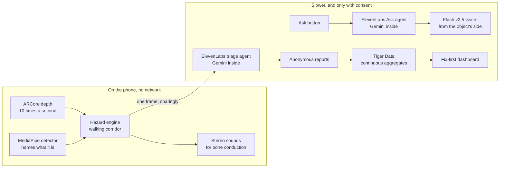

# beluga

beluga warns blind and low-vision pedestrians about obstacles with short sounds that come from the obstacle's side, and turns lasting hazards into a fix-first list for the city of Ottawa.

Belugas find their way by echolocation: they listen to sound bouncing back from what is around them. beluga does the listening for you. The phone measures the depth of everything in your path and plays a sound from the side of whatever is in the way, faster as you get closer.

beluga is a research prototype built at Hack the Hill III. It is not a medical device. Use it alongside a white cane or guide dog, never in place of them.

## Demo

- Try it: [www.beluga.surf/walk](https://www.beluga.surf/walk), in Chrome on an Android phone with ARCore depth. Safari on an iPhone runs camera mode
- City dashboard: [www.beluga.surf/map](https://www.beluga.surf/map)
- Landing page: [beluga.surf](https://beluga.surf)

## How it works

- **Warnings stay on the phone**: depth, the hazard engine and the sounds never touch the network, so a slow or dead connection can't silence a warning.
- **Calibrate before detecting**: in depth mode, object detection, hazard warnings, and Ask wait for successful floor calibration. A timeout with too few floor samples keeps calibration running; it does not unlock detection. Calibration instructions remain audible. Camera-only mode starts paused and requires a separate **Start estimated warnings** tap; it does not provide calibrated distances, drop-off warnings, or head-height warnings.
- **A narrow walking corridor**: only things about 0.9 m wide ahead of you, within 1 m (1.5 m for drop-offs), make a sound. Drop-offs and head-height hazards have their own sounds.
- **Made for bone-conduction earbuds**: they keep the ears open to traffic but lose 3D sound, so the side comes from a level and time difference between the ears, and pitch stands for height.
- **Ask**: one tap sends one camera frame to an ElevenLabs agent that sees with Gemini, and the answer plays from the side of the object it describes.
- **Reports for the city**: with consent, a frame gate picks a few moments worth a look, an agent answers yes or no questions about them, fixed rules decide what gets reported, and Tiger Data ranks the spots worth fixing first.

## Tiger Data

Every event lands in one hypertable, and every dashboard view reads a continuous aggregate in real-time mode, so a report shows up on the map the moment it arrives. The setup is in [`db/migrations`](db/migrations), applied by `npm run db:migrate`.

- **Hypertable**: `hazard_events`, in 1-day chunks, with a PostGIS point generated from the rounded location
- **Continuous aggregates**, all real-time:

| Aggregate | Bucket | Refreshed |
| --- | --- | --- |
| `cell_15m` | 15 minutes, per grid cell, category and source | every minute |
| `cell_daily` | 1 day, stacked on `cell_15m` | every 15 minutes |
| `station_hourly` | 1 hour, per O-Train station | every minute |
| `cell_reporters_daily` | 1 day, distinct reporters per spot | every 5 minutes |

- **Compression and retention as privacy tools**: chunks older than 7 days turn columnar, and raw events are dropped after 180 days while the aggregates keep their counts
- **The fix-first score**, in [`fix_first_for(sources)`](db/migrations/010_fix_first.sql): severity weight (1, 2, 4, 8) × log₂(1 + reporters) × (1 + log₁₀(1 + near-misses)) × recency (1.5 within 48 hours, then halving every 7 days) × 1.3 near a station. A spot needs 3 different reporters before it shows.
- **Performance panel**: the same question, "events and near-misses per cell over the last 7 days", timed by the database on the raw hypertable and on `cell_15m`, next to the compression ratio. On Tiger Cloud's free service with the 429,000-row seed: about 390 ms raw and 17 to 92 ms from the aggregate, compressed chunks 10.4 times smaller, loaded in 53 s.

## ElevenLabs

- **Two agents do the seeing**: a triage agent and an Ask agent, each with a Gemini model from the ElevenLabs model list and one client tool that carries its answer back. They are set up from the repo by `npm run agents` ([`lib/server/agents/config.ts`](lib/server/agents/config.ts), [`scripts/agents`](scripts/agents)). Each backend route runs one text-only turn over the agent's WebSocket, uploads the frame into the conversation, and deletes the conversation once the answer is in ([`lib/server/agents/turn.ts`](lib/server/agents/turn.ts)). An Ask takes about 2.5 s from the agent, plus the voice.
- **A third agent reads the data**: on the dashboard, "Ask the data" takes a planner's question, and the agent calls five lookup tools that the backend answers from the dashboard's own queries on the continuous aggregates, over a read-only connection. No free-form SQL. The answer lists the lookups it used ([`lib/server/agents/data.ts`](lib/server/agents/data.ts)).
- **A designed warning-sound library** from the Sound Effects API ([`scripts/sounds`](scripts/sounds)):

| Sound | Used for | Prompt | Length |
| --- | --- | --- | --- |
| edge\_pulse | Drop-off | Short soft tone sliding down in pitch, like a falling whistle, mid range, clean, no reverb | 0.25 s |
| head\_chime | Head height | Two quick bright glass chime notes, the second higher, short and clean | 0.25 s |
| tick | Obstacle | Short dry wooden block tick, percussive, no reverb | 0.12 s |
| ping | Pole | Single tiny metallic ping, like tapping a thin steel pole, very short and dry | 0.15 s |
| bell | Bike | Quick tiny double bicycle bell ring, crisp and dry | 0.2 s |
| marimba | Person | Soft muted marimba note in the middle register, warm, short decay | 0.15 s |
| buzz | Car, bus, truck | Very short gentle car horn beep, mid pitch, not alarming, no reverb | 0.2 s |
| taps | Blocked path | Three rapid soft taps on hollow plastic | 0.25 s |
| listening | Ask started | Gentle rising two-tone chime, friendly | 0.3 s |
| ready | App ready | Warm soft three-note rising chime | 0.8 s |
| reported | Report sent | Soft single water-drop blip | 0.2 s |
| centre\_tick | Straight ahead | Very short soft click | 0.05 s |

- **Shaped for bone conduction**: ffmpeg cuts everything below 250 Hz (bone conduction only buzzes there), trims and fades each sound, and levels it by peak. Warnings stay WAV, so no MP3 padding delays them. Voice clips say the hazard and its side, like "pole, left", since side cues are weak on bone conduction.
- **The Ask voice**: Flash v2.5 speaks each answer, and the phone plays it from the side of the object described.

## Gemini

Gemini (`gemini-3.5-flash-lite`) is the model inside all three agents.

- **Triage answers questions, and code decides**: the agent picks a category from a fixed list and answers yes or no questions about the photo. Severity and whether to report come from fixed rules tied to Ontario and Ottawa accessibility standards ([`lib/shared/reporting.ts`](lib/shared/reporting.ts)), so the same answers always give the same result.
- **A frame gate keeps calls rare**: new things in the path, lasting obstacles, drop-offs and head-height hazards, with cooldowns and a budget of one frame per 6 s and 150 an hour ([`lib/detect/gate.ts`](lib/detect/gate.ts)). People and cars are never sent.
- **Boxes turned into sound**: when an Ask answer is about one object, its box sets where the answer plays from ([`app/walk/ask.ts`](app/walk/ask.ts)).
- **Never "safe to cross"**: every answer passes a filter that swaps crossing advice for "I can't judge traffic" ([`lib/server/safety.ts`](lib/server/safety.ts)).

## Domain

beluga lives at [beluga.surf](https://beluga.surf), a GoDaddy Registry domain: the landing page, the app at `/walk`, and the city dashboard at `/map`. The app already sends `map.beluga.surf` to the dashboard; it needs its DNS record in Vercel and GoDaddy.

## Privacy

- Reporting is off until you turn it on, and the app says what is sent and what never is.
- Sent: the hazard type, its distance, a location rounded to about 100 m (3 decimals, on the phone and again on the server), and the time.
- Never sent: images, audio, your exact location or who you are. There is no session id in the database.
- Frames go only to the ElevenLabs agents, and each conversation is deleted once ElevenLabs has saved it, a few seconds after the answer. Anything missed goes after a day.
- A random device key becomes a salted hash, on civic reports only, so a spot can count different reporters without knowing who they are. A spot needs 3 of them before it shows.
- Raw events are deleted after 180 days.
- The seeded fortnight is labelled simulated everywhere: in the database, on the dashboard and here.

## Run it yourself

### Requirements

- Node.js 22 or later, and ffmpeg for the sound library
- A Tiger Cloud service (TimescaleDB and PostGIS)
- An ElevenLabs API key and a voice id
- An Android phone with ARCore depth and Chrome, and bone-conduction earbuds

### Setup

1. Run `npm install`
2. Run `cp .env.example .env.local` and fill in the values
3. Run `npm run db:migrate`
4. Run `npm run seed` for the simulated fortnight
5. Run `npm run agents` and copy the three agent ids it prints into `.env.local`
6. Run `npm run sounds` to build the sound library
7. Run `npm run dev`

### On the phone

1. Plug the phone in over USB with USB debugging on
2. Run `npm run phone`
3. Open `http://localhost:3000/walk` in Chrome on the phone

To deploy, import the repository into Vercel and set the same variables there.

## Limitations and next steps

- Depth needs a phone with ARCore depth and a little motion. Glass, dark and shiny floors leave holes in it.
- Without depth, camera-only mode warns about the things the detector can name and about yellow edge strips, but finds no steps or drop-offs. The strip check goes by colour alone, so a yellow mat counts too.
- Safari has no WebXR AR, so an iPhone runs camera mode: the camera and the tilt sensors, with the floor taken to be a chest height below the phone. The same goes for an Android phone that refuses every AR setup.
- Bone conduction gives weaker left and right than headphones, and no up or down.
- The detector knows common objects only: there is no scooter class, so a scooter shows up as a bike, a motorcycle or nothing.
- Ask and reporting need a network. Warnings don't.
- No blind or low-vision users co-designed this version. Next: co-design with CNIB, and a pilot with OC Transpo.

## Credits

- [Magic UI](https://magicui.design) (MIT): the number ticker and the animated beam.
- [Mona Sans](https://github.com/github/mona-sans) by GitHub and [Instrument Serif](https://github.com/Instrument/instrument-serif) (both SIL Open Font License): the headings.
- [Atkinson Hyperlegible](https://www.brailleinstitute.org/freefont/) by the Braille Institute: the body text and every word on the walking screen.
- [Tabler Icons](https://tabler.io/icons) (MIT): the icons.

## License

MIT
